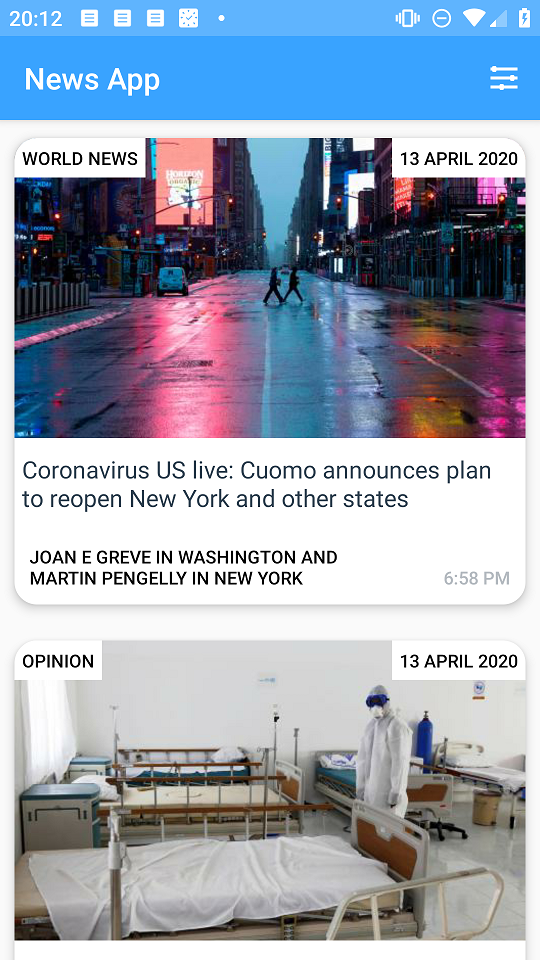
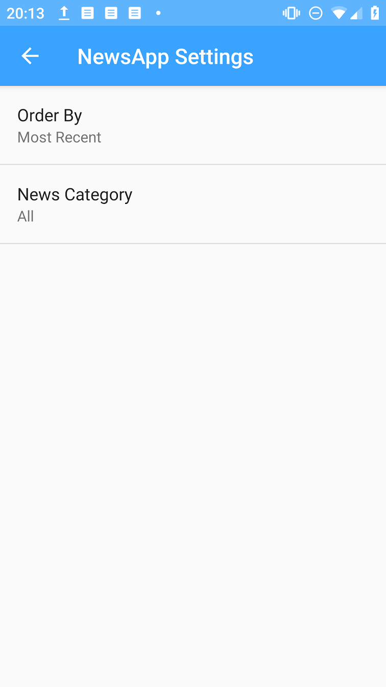
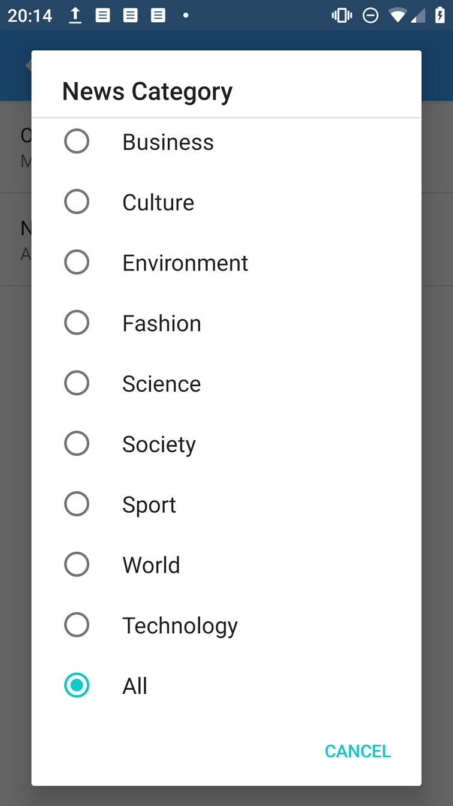
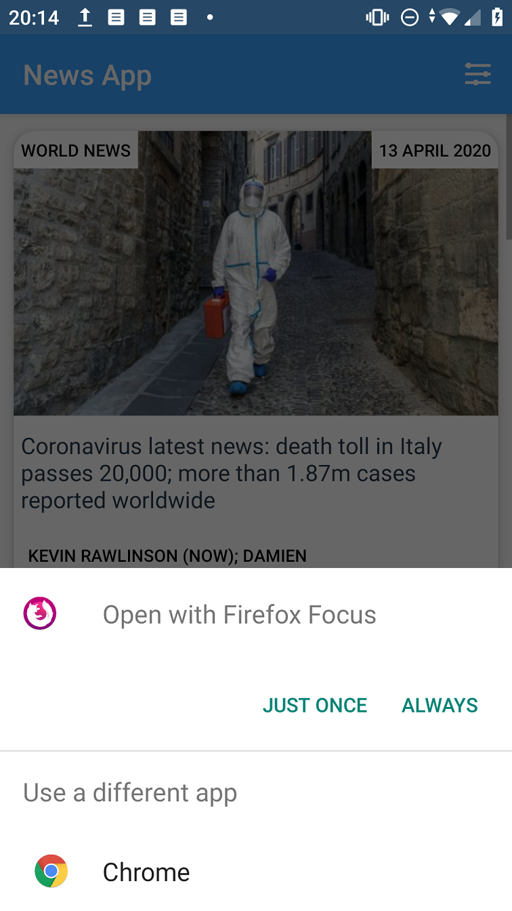

# NewsApp
#### News Feed app
Version 1.1

## Project Overview
The final project is a chance for you to combine and practice everything you learned in this section of the Nanodegree program. You will be making your own app that connects to the Internet to provide news articles on a topic of your choice.

The goal is to create a News Feed app which gives a user regularly-updated news from the Internet related to a particular topic, person, or location. The presentation of the information as well as the topic is up to you.

## Why this project?
In the most recent portion of the Nanodegree program, you worked to build the News app. Along the way, you learned about connecting to the Internet in Android, parsing responses from an API, updating the information in your app, and properly displaying that information. Practicing these skills is imperative in order to build apps that delight and surprise users by anticipating their needs and supplying them with relevant information.

## What will I learn?
This project is about combining various ideas and skills we’ve been practicing throughout the course. They include:

* Connecting to an API
* Parsing the JSON response
* Handling error cases gracefully
* Updating information regularly
* Using an AsyncTask
* Doing network operations independent of the Activity lifecycle
* Use Uri.Builder class to add query parameters to the URL
Update:
Actually, I needed to use StringBuilder instead of Uri.Builder because of the coding difficulties.

## Build Your Project
For this project, you will create a News feed app which gives a user regularly-updated news from the internet related to a particular topic, person, or location. The presentation of the information as well as the topic is up to you.

To achieve this, you will use the Guardian API. This is a well-maintained API which returns information in a JSON format.

We suggest first exploring the API and learning what information it returns given a particular query. Here are some example queries:
* http://content.guardianapis.com/search?q=debates&api-key=test

Or

* https://content.guardianapis.com/search?q=debate&tag=politics/politics&from-date=2014-01-01&api-key=test

Once you've explored the API, begin work in Android Studio. Start with a simple layout to test retrieving and displaying data from the API.

Then, you'll want to build the AsyncTask that queries the API. This can be a complex step, so be sure to reference the course materials when needed.

Once you've queried the API, parse the results. This will involved storing the information returned by the API in a custom class.

Finally, you'll use the List and Adapter pattern to populate a list on the user's screen with the information stored in the custom objects you wrote earlier.

## Getting Started
First, take a look at different kinds of apps on the market.

